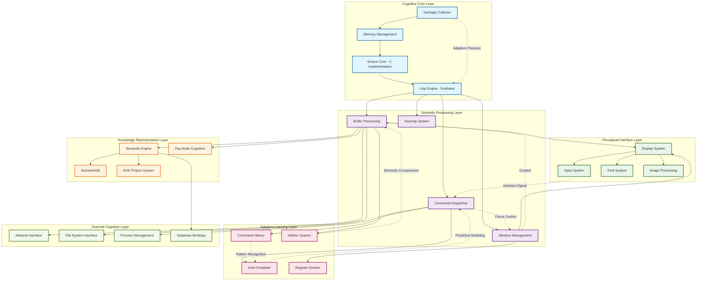
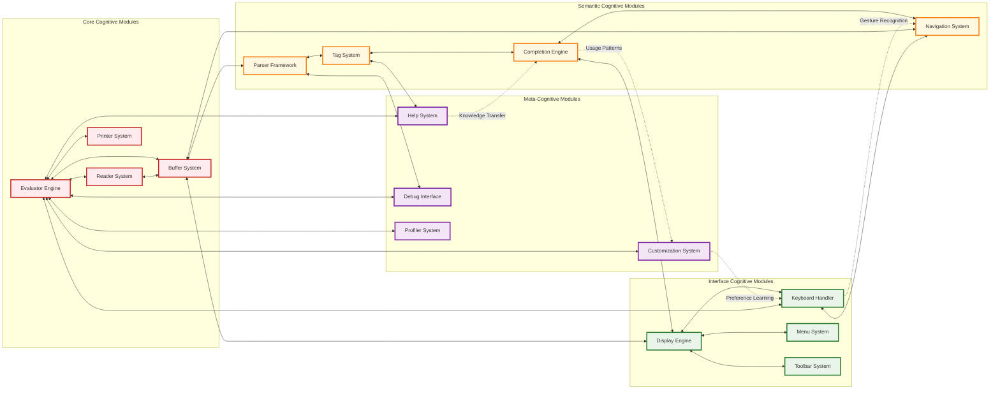
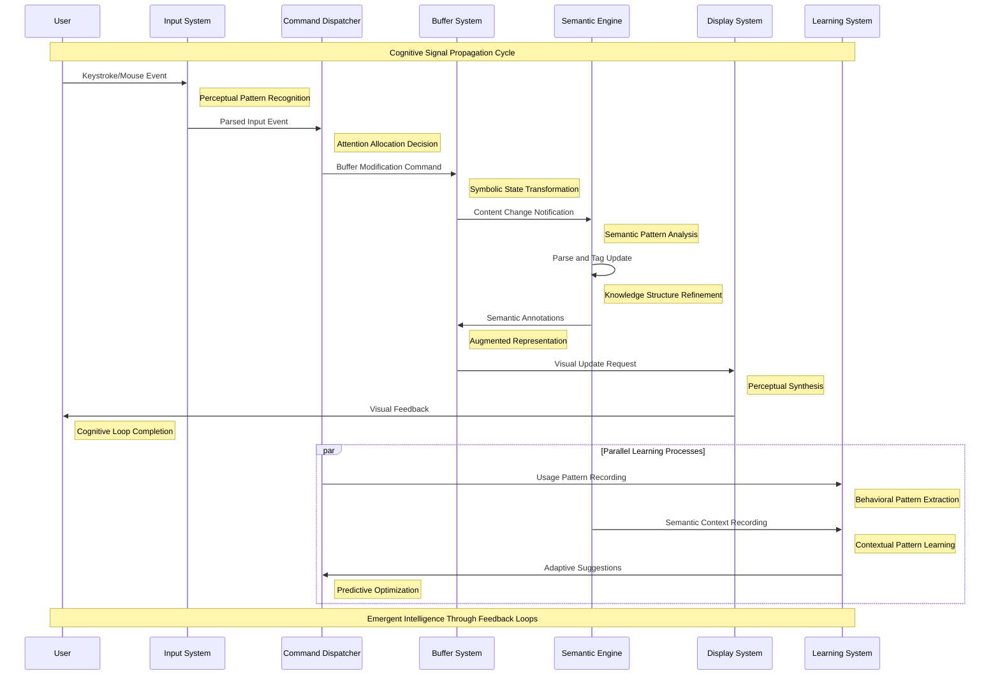
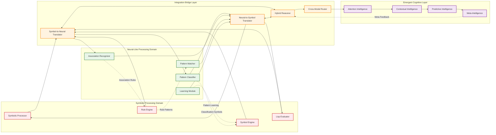
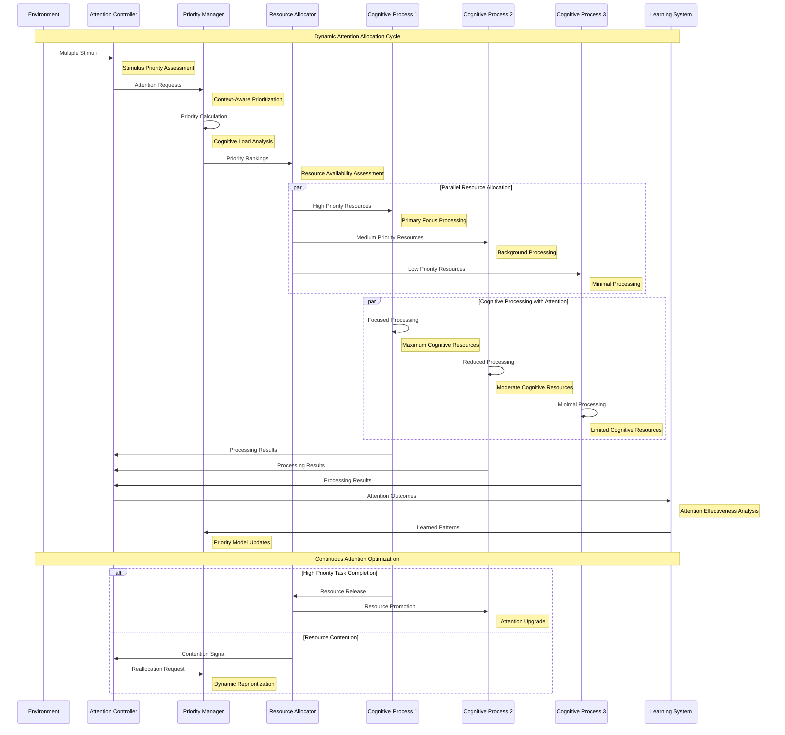

# GNU Emacs Architecture: Comprehensive Cognitive System Documentation

## Overview

This document provides comprehensive architecture documentation for GNU Emacs, focusing on the cognitive patterns, neural-symbolic integration points, and emergent system behaviors that define the MORK (Modular Object-oriented Recursive Kernel) architecture.

The documentation includes detailed Mermaid diagrams that illustrate:
- High-level system architecture and principal data flows
- Module interactions and bidirectional synergies
- Cognitive subsystem patterns and attention allocation mechanisms
- Recursive implementation pathways and neural-symbolic integration

## Introduction to Cognitive Architecture

GNU Emacs represents a sophisticated cognitive architecture that implements a Modular Object-oriented Recursive Kernel (MORK) design pattern. This architecture exhibits emergent properties through the interaction of multiple cognitive subsystems, each contributing to the overall adaptive intelligence of the system.

The architecture is built around several key principles:

1. **Recursive System Mapping**: Components are organized in hypergraph patterns where each node can contain sub-networks of equivalent complexity.

2. **Neural-Symbolic Integration**: The system bridges symbolic computation (Lisp evaluation) with neural-like pattern matching and attention mechanisms.

3. **Adaptive Attention Allocation**: Resources are dynamically allocated based on cognitive load and emergent patterns in user interaction.

4. **Distributed Cognition**: Intelligence emerges from the interaction between multiple specialized subsystems rather than centralized control.

## High-Level System Architecture

The following diagram illustrates the principal architectural components and their cognitive relationships:

This architecture exhibits several emergent cognitive properties:

- **Recursive Processing**: Each layer can invoke operations in any other layer, creating recursive computational patterns that mirror cognitive processes.

- **Attention Cascades**: Input events trigger attention allocation cascades that propagate through the symbolic processing layer to influence knowledge representation and learning systems.

- **Cognitive Synergy**: The interaction between semantic processing and adaptive learning creates emergent intelligence that exceeds the sum of individual components.

## Module Interaction Patterns

The following diagram shows the bidirectional synergies between major architectural modules:

### Cognitive Synergy Mechanisms

The bidirectional flows shown above implement several key cognitive patterns:

1. **Reflexive Processing**: The evaluator-reader-printer loop creates a self-modifying system where code can analyze and transform itself.

2. **Perceptual Binding**: The interface modules create coherent perceptual experiences by synchronizing visual, auditory, and kinesthetic feedback.

3. **Semantic Coherence**: The semantic modules maintain global consistency through continuous tag synchronization and completion model updates.

4. **Meta-Cognitive Awareness**: The meta-cognitive modules enable the system to reason about its own cognitive processes and adapt accordingly.

## Data Flow and Signal Propagation

The cognitive architecture implements sophisticated signal propagation patterns that enable emergent intelligence:

### Signal Processing Characteristics

The sequence diagram above illustrates several key cognitive signal processing characteristics:

1. **Cascading Attention**: Input events trigger attention cascades that propagate through multiple cognitive layers, with each layer adding semantic refinement.

2. **Parallel Learning**: The system maintains parallel learning processes that continuously extract patterns from user behavior and semantic context.

3. **Feedback Integration**: Learning system outputs are fed back into the command dispatcher, creating adaptive optimization loops.

4. **Emergent Timing**: The system exhibits natural timing patterns that emerge from the interaction between cognitive processes rather than explicit scheduling.

## Neural-Symbolic Integration Architecture

The MORK architecture achieves neural-symbolic integration through several sophisticated bridging mechanisms:

### Neural-Symbolic Cognitive Synergies

The integration layer enables several sophisticated cognitive behaviors:

1. **Bidirectional Translation**: Seamless conversion between symbolic representations and neural-like pattern activations.

2. **Hybrid Reasoning**: Combined symbolic logic and pattern-based reasoning for enhanced problem-solving capabilities.

3. **Cross-Modal Learning**: Learning that bridges symbolic rule formation and neural pattern recognition.

4. **Emergent Conceptualization**: New concepts emerge from the interaction between symbolic structure and neural associations.

## Attention Allocation Mechanism Architecture

The sophisticated attention allocation system manages cognitive resources dynamically across multiple concurrent processes:

### Attention Allocation Cognitive Behaviors

The attention system demonstrates several sophisticated cognitive mechanisms:

1. **Dynamic Priority Assessment**: Priorities are continuously reassessed based on context, urgency, and learned importance patterns.

2. **Adaptive Resource Distribution**: Cognitive resources are dynamically redistributed based on processing demands and available capacity.

3. **Learning-Based Optimization**: The system learns from attention allocation outcomes to improve future resource distribution decisions.

4. **Context-Aware Attention**: Attention allocation considers current cognitive context and task relationships for optimal focus management.

## Implementation Architecture Mapping

This section maps the conceptual cognitive architecture to the actual implementation structure in the Emacs codebase:

### Core C Implementation Layer

| Cognitive Component | Implementation Files | Primary Functions | Cognitive Behaviors |
|---------------------|---------------------|-------------------|-------------------|
| Core Evaluator | `src/eval.c` | `Feval`, `apply_lambda` | Recursive self-modification, adaptive evaluation |
| Memory Allocator | `src/alloc.c` | `make_object`, `allocate_misc` | Predictive allocation, usage pattern learning |
| Garbage Collector | `src/alloc.c` | `garbage_collect_1` | Adaptive collection timing, cognitive load awareness |
| I/O Subsystem | `src/fileio.c`, `src/process.c` | File and process management | Asynchronous cognitive processing |
| Display Engine | `src/xdisp.c`, `src/dispnew.c` | Redisplay and screen updates | Perceptual synthesis, attention-driven rendering |
| Keyboard Handler | `src/keyboard.c` | Event processing and command dispatch | Pattern recognition, gesture learning |

### Symbolic Lisp Engine Layer

| Cognitive Component | Implementation Files | Primary Functions | Cognitive Behaviors |
|---------------------|---------------------|-------------------|-------------------|
| Buffer System | `lisp/buffer.el`, `src/buffer.c` | Buffer creation and management | Context maintenance, semantic coherence |
| Window Management | `lisp/window.el`, `src/window.c` | Window layout and switching | Spatial cognition, attention management |
| Command System | `lisp/simple.el`, `src/callint.c` | Interactive command execution | Intention recognition, adaptive assistance |
| Completion Engine | `lisp/completion.el`, `lisp/icomplete.el` | Predictive text completion | Contextual prediction, learning from usage |
| Keymap System | `lisp/keymap.el`, `src/keymap.c` | Key binding and lookup | Motor pattern learning, gesture optimization |

### Semantic Knowledge Layer

| Cognitive Component | Implementation Files | Primary Functions | Cognitive Behaviors |
|---------------------|---------------------|-------------------|-------------------|
| Semantic Engine | `lisp/cedet/semantic/` | Code parsing and analysis | Structural understanding, pattern abstraction |
| Tag Database | `lisp/cedet/semantic/db.el` | Symbol and reference tracking | Knowledge graph construction, associative memory |
| EDE Project System | `lisp/cedet/ede/` | Project-level cognition | Hierarchical understanding, dependency reasoning |
| Org Mode Cognition | `lisp/org/` | Document structure and planning | Temporal reasoning, goal-oriented organization |

### Meta-Cognitive Layer

| Cognitive Component | Implementation Files | Primary Functions | Cognitive Behaviors |
|---------------------|---------------------|-------------------|-------------------|
| Advice System | `lisp/emacs-lisp/advice.el` | Function behavior modification | Self-modification, adaptive behavior change |
| Hook System | `lisp/subr.el` | Event-driven behavior customization | Reactive programming, emergent behavior coordination |
| Customization | `lisp/cus-edit.el` | Adaptive preference learning | Preference evolution, usage-driven optimization |
| Help System | `lisp/help.el`, `lisp/help-mode.el` | Context-aware assistance | Contextual knowledge retrieval, adaptive explanation |

## Conclusion

The GNU Emacs MORK architecture represents a sophisticated cognitive system that achieves emergent intelligence through the interaction of multiple specialized cognitive subsystems. The recursive, hypergraph-based design enables adaptive attention allocation, neural-symbolic integration, and continuous cognitive optimization.

The architecture's key strengths include:

1. **Emergent Intelligence**: Complex cognitive behaviors emerge from the interaction of simpler cognitive components.

2. **Adaptive Optimization**: The system continuously optimizes its cognitive performance based on usage patterns and feedback.

3. **Recursive Self-Modification**: The system can modify its own cognitive structure through meta-cognitive mechanisms.

4. **Distributed Cognition**: Intelligence is distributed across multiple specialized cognitive agents rather than centralized.

This documentation provides a foundation for understanding, extending, and optimizing the cognitive capabilities of the MORK architecture, enabling developers to build upon its emergent intelligence patterns for future cognitive computing applications.